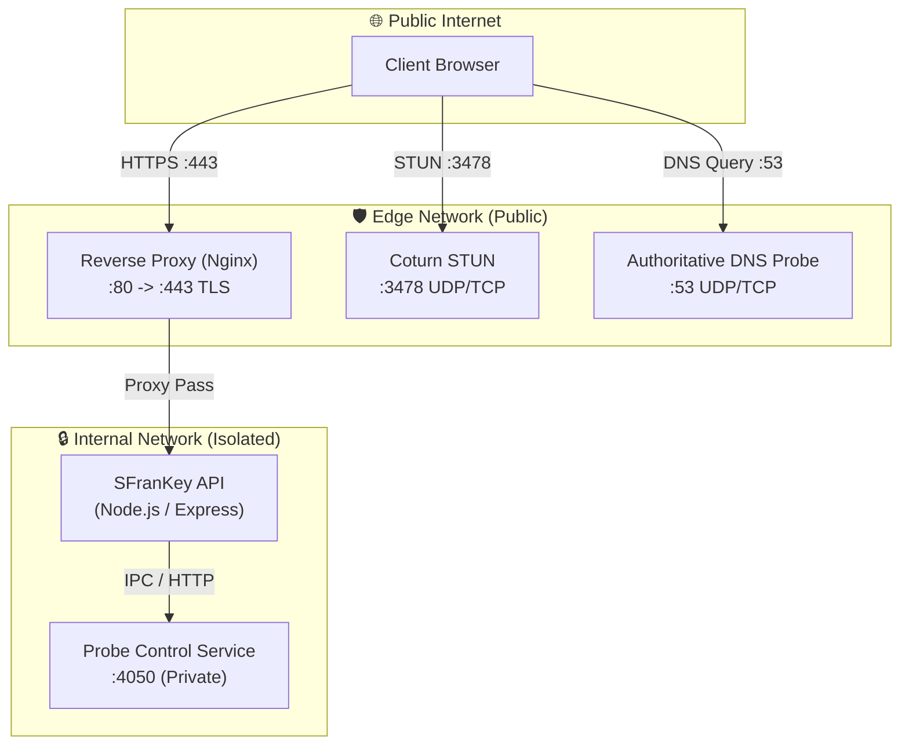

# 🛡️ SFranKey Preview Network Stack
### *Ngăn Xếp Mạng Thử Nghiệm SFranKey (Bilingual: English & Tiếng Việt)*

[](https://docs.docker.com/compose/)
[](https://nginx.org/)
[](https://github.com/coturn/coturn)
[](https://nodejs.org/)
[](file:///d:/nghich%20ng%E1%BB%A3m%20lung%20tung/SFranKey%20Tools/docs/security.md)

---

## 📑 Table of Contents / Mục Lục

- [🇬🇧 English Documentation](#-english-documentation)
  - [1. Overview & Architecture](#1-overview--architecture)
  - [2. Service Topology & Port Allocation](#2-service-topology--port-allocation)
  - [3. Prerequisites & DNS Configuration](#3-prerequisites--dns-configuration)
  - [4. Step-by-Step Deployment](#4-step-by-step-deployment)
  - [5. Validation & Health Checks](#5-validation--health-checks)
  - [6. Security & Container Hardening](#6-security--container-hardening)
- [🇻🇳 Tài Liệu Tiếng Việt](#-tài-liệu-tiếng-việt)
  - [1. Tổng Quan & Kiến Trúc](#1-tổng-quan--kiến-trúc)
  - [2. Bảng Phân Bổ Cổng & Dịch Vụ](#2-bảng-phân-bổ-cổng--dịch-vụ)
  - [3. Yêu Cầu Trước Khi Cài Đặt & Cấu Hình DNS](#3-yêu-cầu-trước-khi-cài-đặt--cấu-hình-dns)
  - [4. Hướng Dẫn Triển Khai Chi Tiết](#4-hướng-dẫn-triển-khai-chi-tiết)
  - [5. Kiểm Tra Hoạt Động & Xác Minh Sức Khỏe](#5-kiểm-tra-hoạt-động--xác-minh-sức-khỏe)
  - [6. Tiêu Chuẩn Bảo Mật & Hardening](#6-tiêu-chuẩn-bảo-mật--hardening)

---

# 🇬🇧 English Documentation

## 1. Overview & Architecture

The **SFranKey Preview Network Stack** is an isolated, containerized environment designed specifically for staging and validating SFranKey's network diagnostic capabilities:
* **Self-Hosted DNS Leak Probe**: Observes recursive resolver requests in real-time.
* **WebRTC STUN Server**: Facilitates ICE candidate gathering without relying on public third-party STUN endpoints.
* **Guarded Network API**: Implements strict SSRF protection, public IP pinning, and rate limiting.
* **Hardened Edge Proxy**: Enforces TLS 1.3, strict security headers, and sandbox network segmentation.



---

## 2. Service Topology & Port Allocation

| Service | Container Image | Port(s) | Network | Description |
|---|---|---|---|---|
| `reverse-proxy` | `nginx:1.27.5-alpine` | `80/tcp`, `443/tcp` | `edge`, `internal` | TLS termination, rate limit headers, security envelope |
| `api` | `sfrankey-api:preview` | Internal | `edge`, `internal` | Network diagnostics backend, SSRF guard |
| `probe` | `sfrankey-probe:preview` | `53/udp`, `53/tcp` | `internal` | Authoritative DNS server & leak measurement pixel |
| `coturn` | `coturn/coturn:4.6.3-r3`| `3478/udp`, `3478/tcp`| `edge` | STUN server for WebRTC candidate gathering |

---

## 3. Prerequisites & DNS Configuration

Before launching the stack, ensure your domain's authoritative DNS zone contains the following records:

```dns
; Primary preview endpoints
preview.sfrankey.com.          IN A      <YOUR_SERVER_IPV4>
preview.sfrankey.com.          IN AAAA   <YOUR_SERVER_IPV6>

; STUN Server endpoint
stun-preview.sfrankey.com.     IN A      <YOUR_SERVER_IPV4>
stun-preview.sfrankey.com.     IN AAAA   <YOUR_SERVER_IPV6>

; DNS Leak Probe NS Delegation
probe-preview.sfrankey.com.    IN NS     ns1.probe-preview.sfrankey.com.
ns1.probe-preview.sfrankey.com. IN A     <YOUR_SERVER_IPV4>
ns1.probe-preview.sfrankey.com. IN AAAA  <YOUR_SERVER_IPV6>
```

> [!IMPORTANT]
> Port `53` (TCP/UDP) must **NOT** be occupied by `systemd-resolved` or `dnsmasq` on the host machine. If port 53 is busy, disable the host stub resolver before starting.

---

## 4. Step-by-Step Deployment

### Step 1: Clone & Configure Environment
```bash
# Navigate to preview deployment directory
cd deploy/preview

# Copy sample configuration
cp .env.example .env

# Edit environment variables with strong random tokens
nano .env
```

### Step 2: Mount TLS Certificates
Mount your DNS-01 issued certificates into the secrets directory:
```bash
mkdir -p secrets/tls
cp /path/to/fullchain.pem secrets/tls/fullchain.pem
cp /path/to/privkey.pem secrets/tls/privkey.pem
chmod 600 secrets/tls/*
```

### Step 3: Validate Compose Specification
```bash
docker compose -f compose.yml config
```

### Step 4: Build & Launch Services
```bash
docker compose -f compose.yml up -d --build
```

---

## 5. Validation & Health Checks

Run these diagnostic commands to ensure all services are operating properly:

```bash
# 1. Check API Health
curl -sS https://preview.sfrankey.com/health | jq .

# 2. Check API Network Capabilities
curl -sS https://preview.sfrankey.com/v1/network/capabilities | jq .

# 3. Test Authoritative DNS Probe
dig @127.0.0.1 -p 53 test.probe-preview.sfrankey.com SOA

# 4. Test STUN Server Binding
stun-client stun-preview.sfrankey.com 3478
```

---

## 6. Security & Container Hardening

* **Read-Only Root Filesystem**: All containers run with `read_only: true` and temporary `tmpfs` mounts for `/tmp` and `/var/run`.
* **Privilege De-escalation**: `security_opt: [no-new-privileges:true]` is enforced across all services.
* **Network Segmentation**: The `internal` network has `internal: true`, preventing DNS probe control ports from being accessed from the public internet.
* **No Indexing**: `X-Robots-Tag: noindex, nofollow, noarchive` is injected on all preview endpoints.

---

<br />

---

# 🇻🇳 Tài Liệu Tiếng Việt

## 1. Tổng Quan & Kiến Trúc

**Ngăn xếp mạng Thử nghiệm (SFranKey Preview Network Stack)** là môi trường container hóa biệt lập, được thiết kế chuyên dụng để staging và kiểm thử các tính năng chẩn đoán mạng của SFranKey:
* **Hệ thống DNS Leak Tự Host**: Giám sát và ghi nhận các recursive DNS resolver theo thời gian thực.
* **STUN Server WebRTC**: Thu thập ICE candidate trực tiếp mà không phụ thuộc vào STUN công cộng của bên thứ ba.
* **API Kiểm Tra Mạng An Toàn**: Tích hợp cơ chế chống SSRF nghiêm ngặt, ghim IP công khai và bảo vệ rate limit.
* **Reverse Proxy Tối Ưu**: Cấu hình TLS 1.3, phân tầng mạng cách ly và bộ lọc bảo mật nhiều lớp.

---

## 2. Bảng Phân Bổ Cổng & Dịch Vụ

| Dịch Vụ | Container Image | Cổng Mở | Phân Vùng Mạng | Mô Tả Chức Năng |
|---|---|---|---|---|
| `reverse-proxy` | `nginx:1.27.5-alpine` | `80/tcp`, `443/tcp` | `edge`, `internal` | Tiếp nhận HTTPS, quản lý chứng chỉ TLS, chuyển tiếp API |
| `api` | `sfrankey-api:preview` | Nội bộ | `edge`, `internal` | Xử lý logic chẩn đoán mạng, SSRF Guard |
| `probe` | `sfrankey-probe:preview` | `53/udp`, `53/tcp` | `internal` | Máy chủ DNS Authoritative đo kiểm rò rỉ DNS |
| `coturn` | `coturn/coturn:4.6.3-r3`| `3478/udp`, `3478/tcp`| `edge` | STUN Server phục vụ kiểm tra WebRTC |

---

## 3. Yêu Cầu Trước Khi Cài Đặt & Cấu Hình DNS

Trước khi khởi chạy hệ thống, hãy đảm bảo domain của bạn đã trỏ các bản ghi DNS cần thiết:

```dns
; Điểm truy cập Web & API Preview
preview.sfrankey.com.          IN A      <IP_V4_MAY_CHU>
preview.sfrankey.com.          IN AAAA   <IP_V6_MAY_CHU>

; Điểm kết nối STUN Server
stun-preview.sfrankey.com.     IN A      <IP_V4_MAY_CHU>
stun-preview.sfrankey.com.     IN AAAA   <IP_V6_MAY_CHU>

; Ủy quyền tên miền cho DNS Leak Probe
probe-preview.sfrankey.com.    IN NS     ns1.probe-preview.sfrankey.com.
ns1.probe-preview.sfrankey.com. IN A     <IP_V4_MAY_CHU>
ns1.probe-preview.sfrankey.com. IN AAAA  <IP_V6_MAY_CHU>
```

> [!WARNING]
> Cổng `53` (TCP/UDP) trên máy chủ không được bị chiếm dụng bởi `systemd-resolved` hoặc `dnsmasq`. Nếu cổng 53 đang chạy, hãy tắt `DNSStubListener` của hệ điều hành trước khi khởi động stack.

---

## 4. Hướng Dẫn Triển Khai Chi Tiết

### Bước 1: Chuẩn Bị File Môi Trường
```bash
# Di chuyển vào thư mục deploy
cd deploy/preview

# Sao chép file cấu hình mẫu
cp .env.example .env

# Chỉnh sửa token bí mật và domain
nano .env
```

### Bước 2: Đặt Chứng Chỉ SSL/TLS
Đặt chứng chỉ Let's Encrypt (DNS-01) vào thư mục `secrets/tls`:
```bash
mkdir -p secrets/tls
cp /duong-dan/fullchain.pem secrets/tls/fullchain.pem
cp /duong-dan/privkey.pem secrets/tls/privkey.pem
chmod 600 secrets/tls/*
```

### Bước 3: Kiểm Tra Tính Hợp Lệ Cấu Hình
```bash
docker compose -f compose.yml config
```

### Bước 4: Khởi Động Toàn Bộ Dịch Vụ
```bash
docker compose -f compose.yml up -d --build
```

---

## 5. Kiểm Tra Hoạt Động & Xác Minh Sức Khỏe

Sau khi khởi chạy, thực hiện các lệnh sau để đảm bảo hệ thống đã sẵn sàng:

```bash
# 1. Kiểm tra trạng thái API
curl -sS https://preview.sfrankey.com/health | jq .

# 2. Kiểm tra năng lực chẩn đoán mạng
curl -sS https://preview.sfrankey.com/v1/network/capabilities | jq .

# 3. Kiểm tra máy chủ DNS Probe
dig @127.0.0.1 -p 53 test.probe-preview.sfrankey.com SOA

# 4. Kiểm tra phản hồi STUN Server
stun-client stun-preview.sfrankey.com 3478
```

---

## 6. Tiêu Chuẩn Bảo Mật & Hardening

* **Hệ thống tệp chỉ đọc (`read_only: true`)**: Mọi container đều chạy ở chế độ Read-Only, ghi tạm vào RAM `tmpfs`.
* **Chặn nâng cao đặc quyền**: Kích hoạt `no-new-privileges: true` nhằm ngăn ngừa leo thang quyền hạn trong container.
* **Mạng nội bộ cách ly (`internal: true`)**: Cổng điều khiển `probe` không mở ra ngoài internet, chỉ chấp nhận kết nối từ `api`.
* **Chặn thu thập dữ liệu tìm kiếm**: Tự động chèn header `X-Robots-Tag: noindex, nofollow` để bảo vệ môi trường preview.

---

<p align="center">
  <b>SFranKey Developer & Security Suite</b><br />
  <sub>Mã nguồn mở vì sự an toàn và quyền riêng tư của cộng đồng lập trình viên.</sub>
</p>
